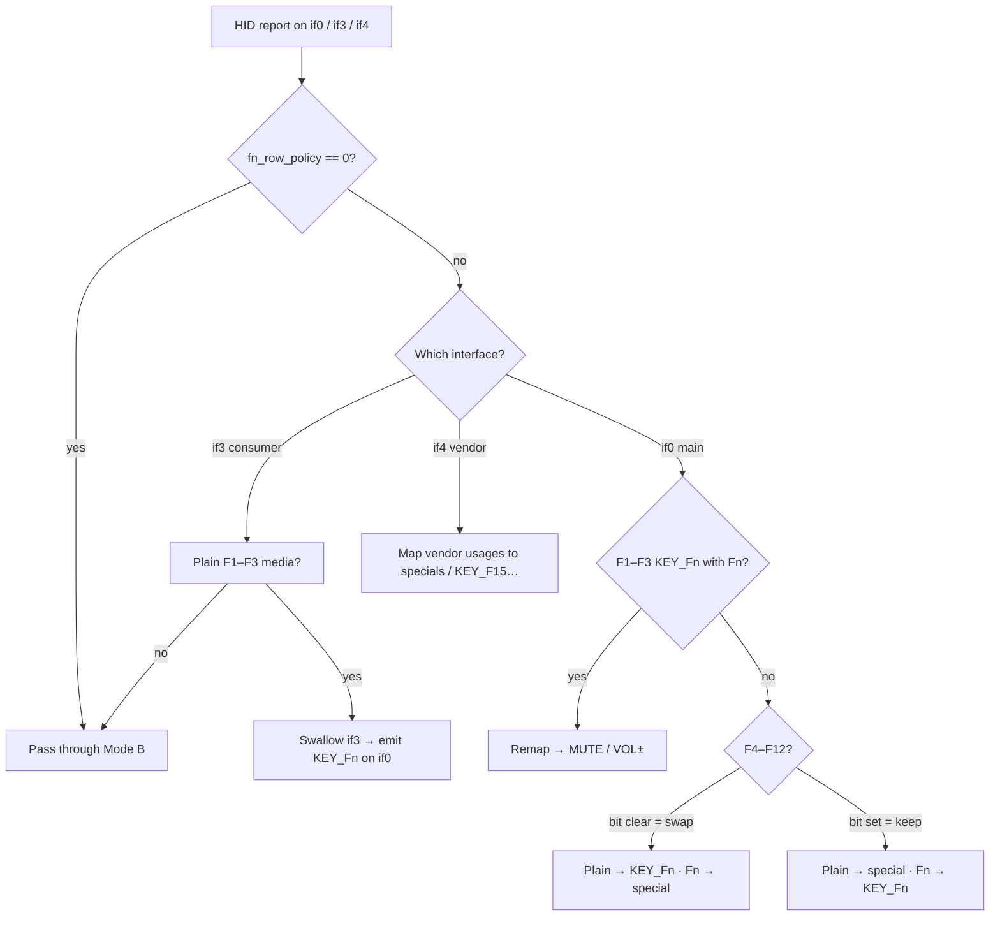

# UX8406 Fn-row policy (`fn_row_policy`)

Detailed reference for the oot **`hid-asus`** module parameter that reshapes the
docked Primax keyboard’s F-row under Linux. Operator quick path:
[`kernel/README.md`](kernel/README.md). Deploy / conf.d:
[`DEPLOY.md`](DEPLOY.md) §F. Regression simulator:
`python3 -m unittest tests.test_fn_row_policy -v`.

## Hardware reality (why a policy exists)

Windows Mode **B** on this dock is roughly:

| Physical | Firmware / HID (Mode B) |
|----------|-------------------------|
| Plain F-key | Special (media, brightness, RFKILL, …) |
| Fn+F-key | `KEY_F*` |

Linux users usually want the opposite for F4–F12 (plain = F-key for terminals /
IDEs; Fn = laptop specials), while F1–F3 are awkward: the EC can still drive
volume independently of the HID keycode.

```
                    ┌─────────────────────────────────────┐
                    │     Primax dock keyboard (USB)      │
                    └──────────────┬──────────────────────┘
           ┌───────────────────────┼───────────────────────┐
           ▼                       ▼                       ▼
     if0 main kbd            if3 consumer            if4 vendor
     (KEY_F*, Meta, …)       (media 03 e2/ea/e9)     (0x10/0x20 BL, …)
           │                       │                       │
           └─────────── hid-asus (oot) + fn_row_policy ────┘
                                 │
                                 ▼
                          evdev / libinput / Plasma
```

**Interfaces involved**

| Interface | Role in Fn-row |
|-----------|----------------|
| **if0** | Boot protocol keyboard — `KEY_Fn`, modifiers, some Fn remaps |
| **if3** | Consumer Control — plain F1–F3 media codes when firmware emits them |
| **if4** | Vendor usages — brightness, kbd BL, screen swap, mic, RFKILL, emoji, ASUS key |
| **EC** | May change volume on F2/F3 even when HID reports `KEY_F*` — **not HID-gatable** |

## Bitmask layout

`fn_row_policy` is a **decimal** `u32` module parameter (bits below).

| Bit | Key | Bit **set** (1) | Bit **clear** (0) |
|-----|-----|-----------------|-------------------|
| 0 | F1 | *unused* | *unused* |
| 1 | F2 | *unused* | *unused* |
| 2 | F3 | *unused* | *unused* |
| 3 | F4 | Keep Mode B (plain = special, Fn = `KEY_F4`) | **Swap** (plain = `KEY_F4`, Fn = special) |
| 4 | F5 | Keep Mode B | **Swap** |
| 5 | F6 | Keep Mode B | **Swap** |
| 6 | F7 | Keep Mode B | **Swap** (+ Win+P handling) |
| 7 | F8 | Keep Mode B | **Swap** |
| 8 | F9 | Keep Mode B | **Swap** |
| 9 | F10 | Keep Mode B | **Swap** |
| 10 | F11 | Keep Mode B | **Swap** |
| 11 | F12 | Keep Mode B | **Swap** |
| 12+ | — | reserved / unused | reserved / unused |

```
  bit:  11 10  9  8  7  6  5  4  3  2  1  0
        F12 F11 F10 F9 F8 F7 F6 F5 F4 F3 F2 F1
        └─── F4–F12: 0 = swap, 1 = keep Mode B ──┘ └─ ignored ─┘
```

**F1–F3 (bits 0–2) are ignored.** When `fn_row_policy ≠ 0`:

- Plain F1–F3: if3 media is swallowed → emit `KEY_F1`–`KEY_F3` on if0.
- Fn+F1–F3: if0 `KEY_F*` remapped to `KEY_MUTE` / `KEY_VOLUMEDOWN` / `KEY_VOLUMEUP`.
- Meta/Alt/Ctrl+F1–F3: stay as `KEY_Fn` for workspaces / launcher chords.

When `fn_row_policy = 0`: **no** Fn-row remaps (firmware Mode B as-is).

## Recommended docked default: `7`

```
7 = 0b0000_0111 = bits 0–2 set numerically, but those bits are unused;
    bits 3–11 are clear → F4–F12 all swapped.
```

In practice **`fn_row_policy=7` means “F4–F12 swapped + F1–F3 fixed remap on”**
(any non-zero policy enables F1–F3 handling; `7` is the historical/default value
written by UX8406 install into `/etc/conf.d/zenbook-kb-hid-asus`).

### Chord table (policy = 7)

| Chord | Effect |
|-------|--------|
| Plain F1–F3 | `KEY_F1`–`KEY_F3` (if3 media swallowed → if0). Terminal may show `^[OP` etc. |
| Fn+F1–F3 | `KEY_MUTE` / `KEY_VOLUMEDOWN` / `KEY_VOLUMEUP` |
| Meta/Alt/Ctrl+F1–F3 | `KEY_Fn` (desktop chords) |
| Plain F4–F12 | `KEY_F*` |
| Fn+F4 | Keyboard backlight toggle |
| Fn+F5 / Fn+F6 | Screen brightness down / up |
| Fn+F7 | Win+P (Plasma display switch) |
| Fn+F8 | `KEY_F15` → `platform-screen-swap` (hotkeys) |
| Fn+F9 | `KEY_MICMUTE` |
| Fn+F10 | `KEY_RFKILL` |
| Fn+F11 | `KEY_EMOJI_PICKER` |
| Fn+F12 | `KEY_PROG1` (ASUS / MyASUS key) |
| Meta+F4–F12 | **Meta +** `KEY_Fn` |
| Super tap | `KEY_LEFTMETA` pulse |

```
  Physical row (legend):   [F1] [F2] [F3] [F4] [F5] [F6] [F7] [F8] [F9] [F10] [F11] [F12]
  Plain @ policy=7:         F1   F2   F3   F4   F5   F6   F7   F8   F9   F10   F11   F12
  Fn+F   @ policy=7:       mute  vol- vol+  BL  brt- brt+ WinP F15  mic  RFKILL emoji ASUS
```

### Useful other values

| Value | Meaning |
|------:|---------|
| `0` | Disable all remaps (raw Mode B) |
| `7` | **Default docked** — F4–F12 swap + F1–F3 fixed path |
| `15` (`0x0F`) | Leaves F4 on Mode B (plain = BL special) — usually wrong for Linux |
| `4088` (`0xFF8`) | Hypothetical: only F4–F12 swapped if you ever treated bits 0–2 as meaningful (they are not) |

## Decision flow (per event)



## Sticky-Meta / Win+P edge cases (F7 and Meta+Fx)

Firmware often emits a **GUI-only** precursor before Win+P or Meta+Fx. The quirk:

1. Defers lone Meta so a plain F7 does not flash the overview / Super menu.
2. Tracks **synthetic** Meta↓ that the driver injected (HID will not clear it).
3. Emits Meta↑ on GUI release so Fn+Fx never becomes Meta+Fx after a workspace chord.

```
  Meta+F1 then Fn+F5:
    Meta↓ F1↕ Meta↑   …then…   BRIGHTNESSDOWN   ✓
    Meta↓ F1↕         …then…   Meta+BRIGHTNESS  ✗ (sticky Meta bug)
```

Simulator coverage: rows 8–11 in `tests/test_fn_row_policy.py` `ACTION_TABLE`.

## EC volume caveat

Even when the keycode is `KEY_F2` / `KEY_F3`, the **embedded controller may still
nudge system volume**. That path is outside HID. Users who need quiet F2/F3 often
rebind Plasma media shortcuts or live with EC behaviour.

## How to set it

Boot / OpenRC sideload uses **`insmod`**, not `modprobe` — conf.d wins:

```bash
# /etc/conf.d/zenbook-kb-hid-asus  (written by configure on UX8406)
fn_row_policy=7
fn_lock_default=0
fn_lock_allow_toggle=0
```

```bash
# One-shot redeploy from checkout
ROW_POLICY=7 ./kmod_deploy.sh
```

```bash
# Live tweak until next reload (sysfs)
echo 7 | sudo tee /sys/module/hid_asus/parameters/fn_row_policy
```

`modprobe.d` alone is **not** enough for the OpenRC sideload path.

## Bluetooth vs USB (important)

`fn_row_policy` remaps need **USB** interfaces if0 / if3 / if4 (`0b05:1b2c` on
pogo pins). Bluetooth `0b05:1b2d` is a single HID keyboard collection — the same
bitmask **does not apply**.

| Transport | Keys | Fn-row |
|-----------|------|--------|
| USB pogo + oot `hid-asus` | yes | `fn_row_policy=7` (this document) |
| Bluetooth + broken stock/oot Usage(76h) **rdesc** fixup | **no keyboard node** (touchpad only) | n/a |
| Bluetooth + oot that **skips** BT rdesc fixup + maps usage `0x76` | yes | firmware **Mode B**; invert with `platform-bt-fn-row run` |

Plain F12 on BT used to spam `Unmapped Asus vendor usagepage code 0x76` and do
nothing — oot now maps vendor `0x76` → `KEY_PROG1` (ASUS key). With
`platform-bt-fn-row`, that becomes plain `KEY_F12`.

### Bluetooth Mode B vs expected (docked policy=7)

`Fn` column: `0` = plain key, `1` = Fn held. Observed = stock BT firmware
(Mode B). Expected = same as USB `fn_row_policy=7`.

| Fn | Key | Observed (BT Mode B) | Expected (policy=7) | `platform-bt-fn-row` |
|---:|-----|----------------------|---------------------|----------------------|
| 0 | F1–F3 | vol mute / − / + | `KEY_F1`–`F3` | yes (swap media↔F) |
| 1 | F1–F3 | `KEY_F1`–`F3` | vol mute / − / + | yes |
| 0 | F4 | kbd BL / vendor (often) | `KEY_F4` | yes if `KEY_KBDILLUMTOGGLE` |
| 1 | F4 | `KEY_F4` | kbd BL toggle | yes |
| 0 | F5–F6 | brightness −/+ (often) | `KEY_F5`–`F6` | yes if brightness keys |
| 1 | F5–F6 | `KEY_F5`–`F6` | brightness −/+ | yes |
| 0 | F7 | display config (Win+P) | `KEY_F7` | **partial** — chord, not 1:1 |
| 1 | F7 | `KEY_F7` | Win+P / display config | **partial** |
| 0 | F8 | screen-swap vendor / `???` | screen swap (`KEY_F15`) | yes if `KEY_F15`↔`F8` |
| 1 | F8 | `KEY_F8` (typical) | `KEY_F8` | passthrough |
| 0 | F9–F12 | mic / rfkill / emoji / ASUS (`0x76`) | `KEY_F*` | yes when codes match |
| 1 | F9–F12 | `KEY_F*` | specials | yes |

Invert on BT: `sudo platform-bt-fn-row run` (grab + uinput). USB pogo does **not**
need it — kernel policy already applies.

If BT is connected but only Mouse/Touchpad appear, `dmesg` shows
`item fetching failed at offset 257/259` — sideload the oot module from this
repo (`./kmod_deploy.sh`) and reconnect Bluetooth. `platform-probe` reports
**Duo keyboard (Bluetooth)** health.

## Related knobs

| Parameter | Typical docked | Meaning |
|-----------|----------------|---------|
| `fn_lock_default` | `0` | Mode B firmware baseline |
| `fn_lock_allow_toggle` | `0` | Ignore Fn+Esc / vendor `0x4e` |
| `fn_row_policy` | `7` | This document |

## See also

- [`kernel/README.md`](kernel/README.md) — build, install, rebind
- [`DEPLOY.md`](DEPLOY.md) — conf.d reference
- [`README.ux8406.md`](README.ux8406.md) — model overview
- [`conf.d/UX8406.evdev.conf`](conf.d/UX8406.evdev.conf) — Plasma chords after swap
- `tests/test_fn_row_policy.py` — behavioural action table
